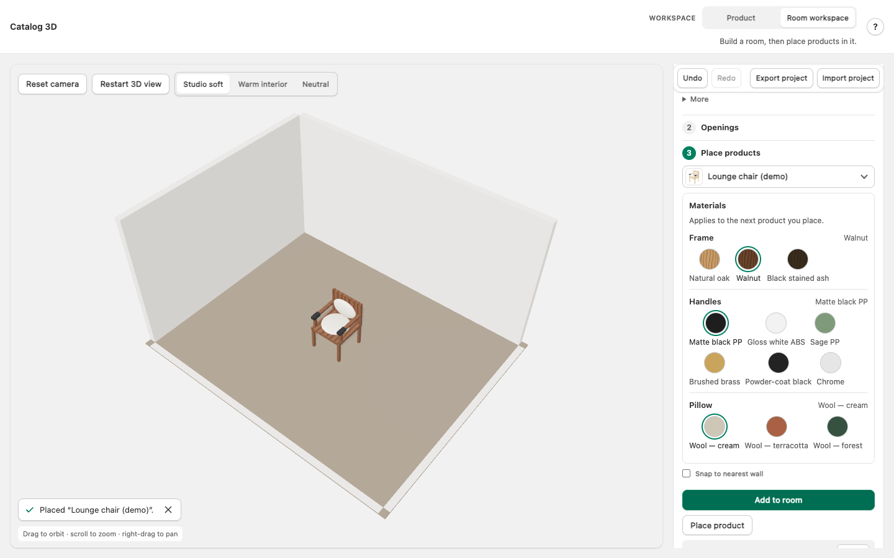

# Room Vibez · Catalog 3D (v2)

A browser-based furniture viewer and room planner built on **Three.js**, **Vite** and **TypeScript**. Spin a product and change the material of each part, then build a room, place products in it, and keep the result as a file. Everything runs in the browser; there are no accounts, no cloud storage and no prices.

This repository is **v2**: the Catalog 3D viewer after one large, tested UX fix (October 2026). The fix was built in eight planned waves; six were completed and are in the history here, one commit per wave. Two waves and the final audit were skipped on the owner's instruction, so parts of the app are unfinished; [docs/known-gaps.md](docs/known-gaps.md) says which.

| | |
|---|---|
| App | [`hackathon-3d-viewer/`](hackathon-3d-viewer/) · runs at http://127.0.0.1:18777/ |
| Static click-through prototype of the wider planner | [`prototypes/room-vibez-planner-flows/`](prototypes/room-vibez-planner-flows/) · open `index.html` in a browser |
| Documentation | [docs/index.md](docs/index.md) |
| For AI agents and tools continuing the work | [AGENTS.md](AGENTS.md) → [handoff/](handoff/README.md) |



## Run it

Requires Node.js 18 or newer and a browser with WebGL. Developed and tested with Node 24 on macOS; Chromium is the only browser the test suite covers.

```bash
cd hackathon-3d-viewer
npm install
npm run dev          # → http://127.0.0.1:18777/
```

On a Mac you can instead double-click `hackathon-3d-viewer/Start Viewer.command`; on Windows, `Start Viewer.bat`. [hackathon-3d-viewer/QUICKSTART.md](hackathon-3d-viewer/QUICKSTART.md) has the details, including a software-rendering launcher for machines without working WebGL.

| Command (in `hackathon-3d-viewer/`) | Does |
|---|---|
| `npm run dev` | Dev server with hot reload on port 18777 (`--strictPort`: "port in use" means it is already running) |
| `npm run build` | Type-check and production build to `dist/` |
| `npm run preview` | Serve `dist/` on port 18778 |
| `npm run typecheck` | `tsc --noEmit` |
| `npm test` | Unit tests (Vitest), 340 tests in 30 files |
| `scripts/run-e2e-scratch.sh --workers=1` | End-to-end tests (Playwright on the installed Google Chrome, software WebGL), 74 tests. See [docs/testing.md](docs/testing.md) for why not `npm run test:e2e` |

## What you can do

**Product workspace.** Choose a product from a picker with rendered thumbnails or a list; drag to spin it; change the material of each part (frame, handles, pillow …) from swatches; switch the lighting; add your own GLB, glTF or OBJ model, or a texture image, for the session.

**Room workspace.** Four steps: build a room (from a preset or typed size, by tracing a plan image, from a saved template, or by drawing walls), add doors and windows, place products (with one click on "Add to room" or by clicking the floor), and choose wall and floor finishes. Placed products keep the finish you chose and can be selected, moved with the arrow keys, rotated and removed. Undo and redo cover room changes. The room saves in the browser as you go; "Export project" writes it to a file you can open again.

A **?** button in the top bar explains how each part works and why the app is built the way it is. The same text is the source for [docs/using-the-app.md](docs/using-the-app.md).

## What this app does not claim

Taken from [hackathon-3d-viewer/ASSUMPTIONS.md](hackathon-3d-viewer/ASSUMPTIONS.md), which is the authoritative list:

- No real DWG/DXF reading. A DWG or DXF upload shows a clearly labelled **sample** room; reading real files needs an ODA or Autodesk APS licence that is not set up.
- No AI floor-plan recognition. A plan image is traced at the size you type.
- Demo products are procedural stand-ins; SKUs are placeholders; there are no prices.
- Doors and windows are cutouts with placeholder shapes, not catalog products.
- Models, textures and plans you upload last until you refresh. Rooms and templates persist in the browser; "Export project" is the way to keep them.
- No AR, no second 3D engine, no cloud projects.

## Status, honestly

| | |
|---|---|
| Done and verified | Waves 1 to 6a of the fix: see [docs/changes-in-v2.md](docs/changes-in-v2.md). After the last commit: typecheck clean · unit 340/340 · build OK · e2e 74/74 (the last figure as reported by the agent that ran it) |
| Not done | Message and error wording from the engine (wave 6b), target sizes and accessibility (wave 7), the 72-gate audit and completion report (wave 8): [docs/known-gaps.md](docs/known-gaps.md) |
| Not verified by anyone | Use by real people (no usability test has been run), screen readers, Safari, Firefox, Windows, real phones. All interaction tests ran in headless Chrome on software rendering |
| Decisions waiting for the owner | [docs/decisions-for-the-owner.md](docs/decisions-for-the-owner.md) |

## How this was built

The fix was specified by four written handoffs (behaviour, copy, catalog pickers, QA), then implemented by AI agents working in waves, each verified in a browser before the next started. The specifications, the plan, every agent's report and the evidence behind each number are in [handoff/](handoff/README.md). The commit history is the audit trail: `git log --oneline` reads as one commit per wave on top of a baseline of the untouched app.

## Repository layout

```text
hackathon-3d-viewer/   the app (Vite + TypeScript + Three.js); see its README.md and ARCHITECTURE.md
prototypes/            static HTML click-through of the wider planner flows
docs/                  documentation for people: start at docs/index.md
handoff/               specifications, plan, agent reports and evidence, for whoever continues the work
AGENTS.md, CLAUDE.md   entry points for AI coding agents
```

## Licence

No licence has been chosen for this repository yet. Until one is added, the default copyright terms apply.