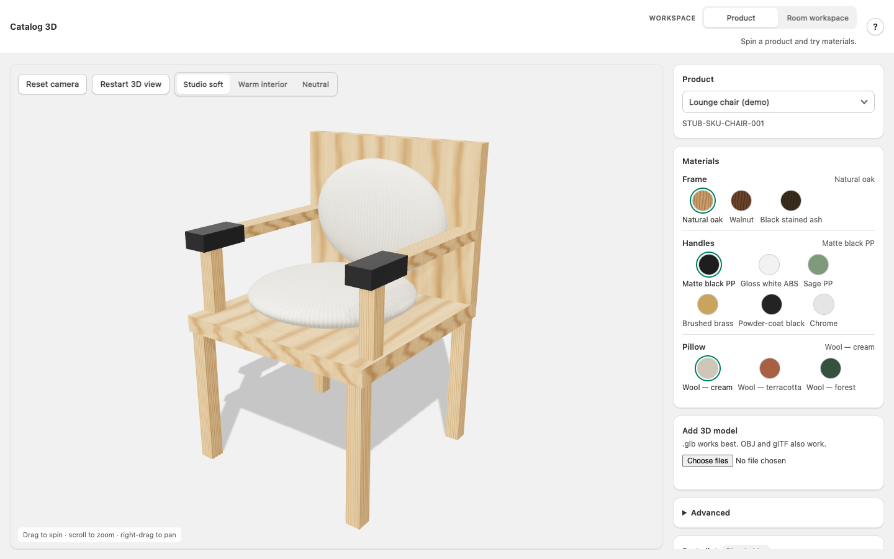
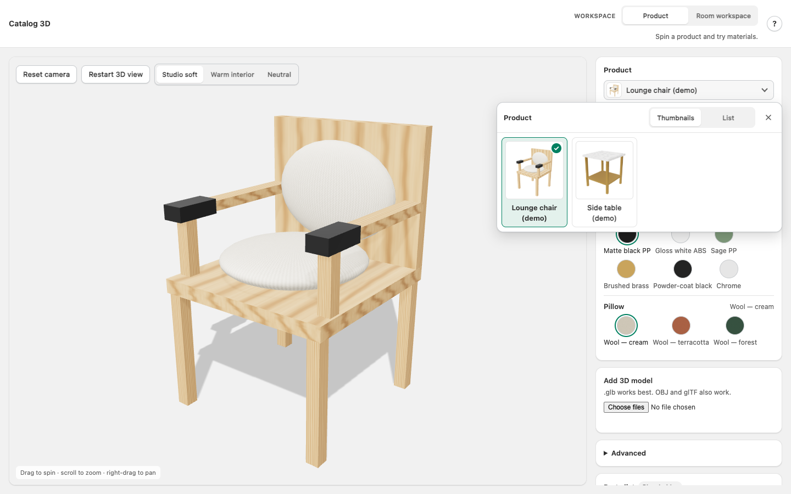
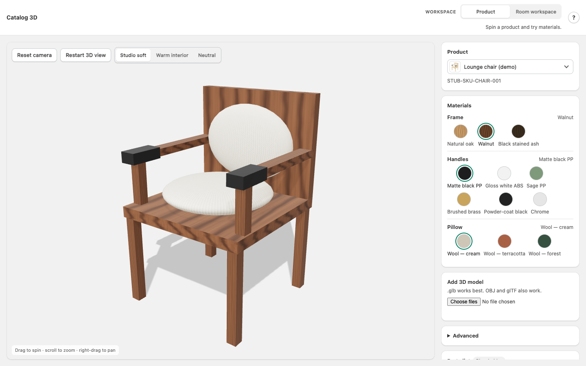
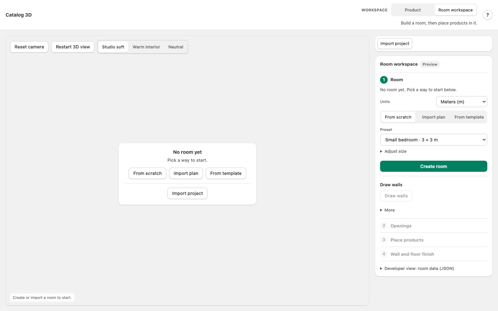
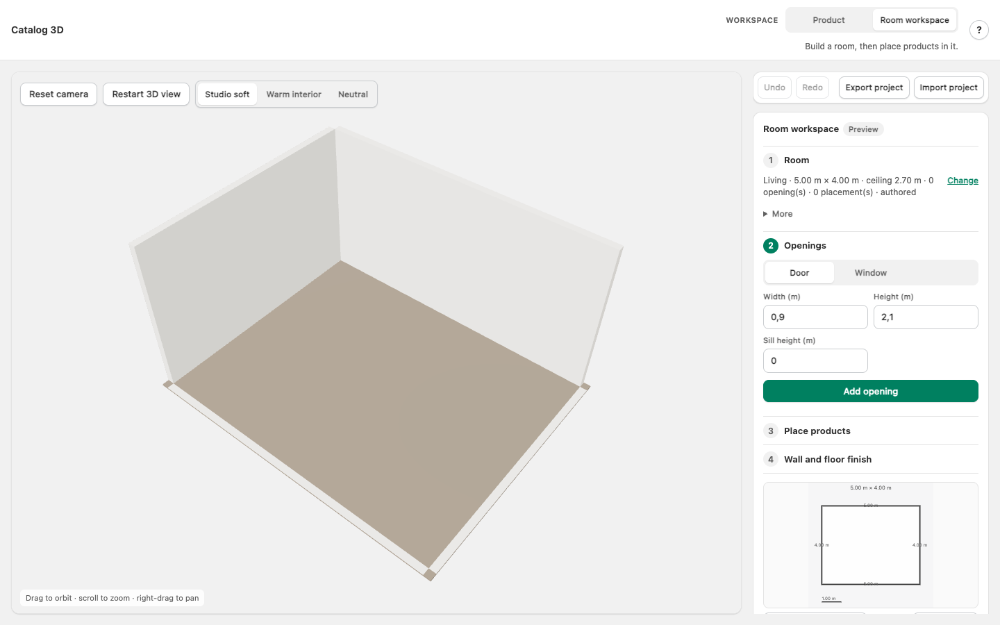
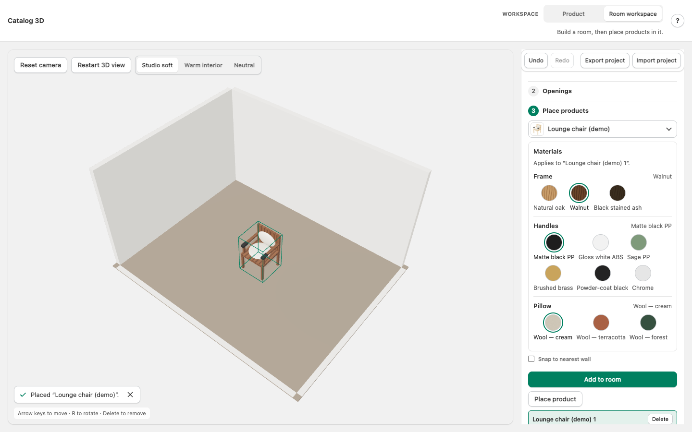
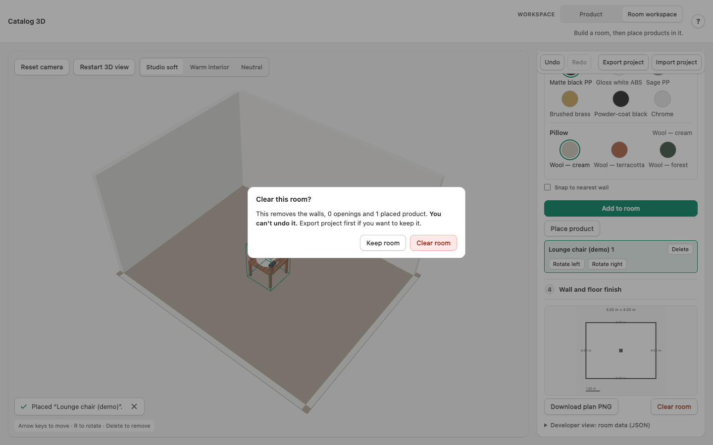

# Room Vibez · Catalog 3D (v2)

Catalog 3D is a browser-based furniture viewer and room planner built on Three.js. You spin a product and change what each part is made of, then build a room, place products in it, and keep the result as a file. Everything stays in your browser: no accounts, no cloud, no prices.

This site documents **v2**: the app after a large UX fix, built and verified in waves in October 2026. It is a working version with known gaps, not a finished product; [Known gaps](known-gaps.md) lists them plainly.

## Start here

| If you want to … | Read |
|---|---|
| Run the app on your machine | [Getting started](getting-started.md) |
| Learn what the app does and how to use it | [Using the app](using-the-app.md) |
| Understand how it is built | [Architecture](architecture.md) |
| Run or extend the tests | [Testing](testing.md) |
| See what the fix changed, wave by wave | [Changes in v2](changes-in-v2.md) |
| Know what is unfinished or unverified | [Known gaps](known-gaps.md) |
| See the decisions still open for the owner | [Decisions for the owner](decisions-for-the-owner.md) |
| Continue the work as an AI agent or developer | [The handoff](../handoff/README.md) and [AGENTS.md](../AGENTS.md) |

## The app in six pictures

| | |
|---|---|
|  Products are chosen from a picker with rendered thumbnails or a list |  Each part has its own swatches with names |
|  The Room workspace with no room offers four ways to start |  After "Create room" the whole floor is visible; near walls are cut away |
|  A placed product keeps its finish and can be selected, moved, rotated and removed |  Destroying work asks first, with the counts |

The same views at phone size (375 × 812) are in [screenshots/](screenshots/).

## Where the words come from

Every sentence on screen comes from one copy deck written before the fix, transcribed into `src/copy.ts`. The **?** button in the app opens the same help text that [Using the app](using-the-app.md) is based on. Where the deck is ambiguous or was made false by the fix itself, the handoff lists the case rather than resolving it silently.
