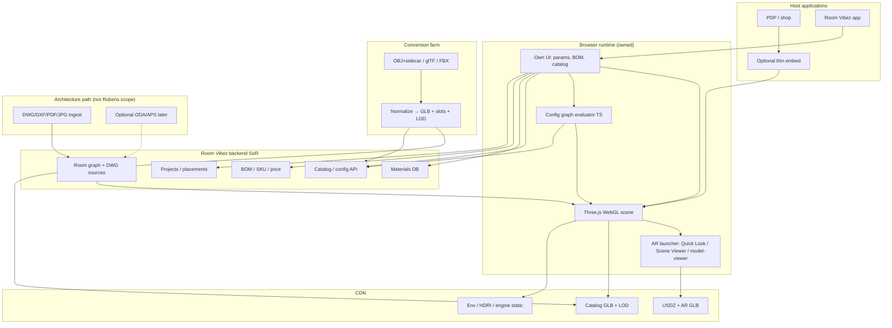

# Room Vibez advisory — Rubens-like architecture analysis

**Document type:** Competitive / architecture advisory (public docs only)  
**Date:** 2026-10-01  
**Rule:** Cite official Roomle docs, Khronos/Apple/Google AR docs, and prior Room Vibez project docs. Do **not** invent undocumented Roomle internals (WASM internals, proprietary kernel algorithms, unpublished SLA, or reverse-engineered binary behavior). Mark **Unknown** where sources are silent.  
**Marketing vs docs:** Claims from [roomle.com/en/3d-viewer](https://www.roomle.com/en/3d-viewer) are labeled **(marketing)**.

**Primary sources (official):**

| Source | URL |
|---|---|
| Rubens SDK overview | https://docs.roomle.com/rubens/rubens-sdk/overview |
| Rubens SDK getting started | https://docs.roomle.com/rubens/rubens-sdk/getting-started |
| Rubens SDK module index | https://docs.roomle.com/rubens/rubens-sdk |
| Rubens Modules | https://docs.roomle.com/rubens/rubens-sdk/rubens-modules |
| Products vs SDK | https://docs.roomle.com/rubens/rubens-products/rubens-products-vs.-rubens-sdk |
| Configurator concepts | https://docs.roomle.com/rubens/rubens-sdk/rubens-configurator/configurator-concepts |
| GLB Viewer & AR (SDK) | https://docs.roomle.com/rubens/rubens-sdk/rubens-3d-viewer-and-ar/getting-started |
| Custom AR button | https://docs.roomle.com/rubens/rubens-products/rubens-configurator/recipes/implement-custom-ar-button |
| Room Designer (Products) | https://docs.roomle.com/rubens/rubens-products/rubens-room-designer/getting-started |
| Parts list / prices | https://docs.roomle.com/rubens/rubens-products/rubens-configurator/integration/listen-to-events/parts-list-changes |
| Material configurator (Admin) | https://docs.roomle.com/rubens/quick-start-guides/convert-your-static-product-into-a-material-configurator |
| Roomle Scripting | https://github.com/Roomle/scripting-docu |
| Docs index | https://docs.roomle.com/llms.txt |
| 3D Viewer marketing | https://www.roomle.com/en/3d-viewer **(marketing)** |
| Google Scene Viewer | https://developers.google.com/ar/develop/java/scene-viewer |
| Apple AR Quick Look | https://developer.apple.com/augmented-reality/quick-look/ |
| model-viewer AR | https://modelviewer.dev/docs/ |
| Khronos glTF / PBR | https://www.khronos.org/gltf/pbr · https://registry.khronos.org/glTF/specs/2.0/glTF-2.0.html |

**Prior Room Vibez docs used:** `platform-stack-research.md`, `obj-engines-planner-ai-qa.md`, `format-dwg-vs-obj-planner-gap-plan.md`, `persona-formats-and-planner5d-full-plan.md`, `final-supported-file-formats.md`, core architecture diagram (`diagrams/core-architecture-1600x900.jpg` / generator).

**Locked Room Vibez decisions (from those docs):** Three.js-only runtime; catalog runtime **GLB** + `material_slot_id` / materials DB; architecture interchange **DWG** (+ PDF/JPG/PNG sketches) → owned room graph; **own BOM/SKU** SoR; owned **conversion farm**; optional Planner 5D embed with exit ramp; optional no-full-planner path for PDP/configurator-first products.

---

## 1. Rubens product surface — Viewer / AR, Configurator, Planner

### 1.1 What Rubens is (docs)

Roomle documents two delivery layers:

1. **Rubens Products** — ready-to-use UIs (iframe / embedding library), skinning, automatic update cycle.  
2. **Rubens SDK** (`@roomle/web-sdk`) — same 3D packages that power the platform; you build your own UI; you own updates.  
   Sources: [SDK overview](https://docs.roomle.com/rubens/rubens-sdk/overview), [Products vs SDK](https://docs.roomle.com/rubens/rubens-products/rubens-products-vs.-rubens-sdk).

SDK ships **three ready-to-use modules** ([Rubens Modules](https://docs.roomle.com/rubens/rubens-sdk/rubens-modules)):

| Module | Docs name | Role (docs wording) |
|---|---|---|
| **GLB Viewer** | Rubens 3D Viewer & AR | Display GLB / static items; AR via platform assets |
| **Configurator** | Rubens Configurator | Configurable products (parameters + structural addons) as used in webshops |
| **Planner** | Rubens Room Designer / Planner | “Configurator on steroids” — multiple objects in rooms; rooms configurable |

Access pattern: `RoomleSdk.getGlbViewer()` / `getConfigurator()` / `getPlanner()` → `boot()` → `getApi()` → `init(dom)` → load/insert. Event system is callback-assignment on `api.callbacks` (not `addEventListener`).

Products also expose a third path: **SDK + fork of Rubens Configurator UI** (Vue.js / vue-cli template). Docs warn: after fork, Roomle does not support the UI code; upgrades become harder; often pure SDK is better long-term ([Products vs SDK](https://docs.roomle.com/rubens/rubens-products/rubens-products-vs.-rubens-sdk)).

### 1.2 Viewer & AR — docs vs marketing

**Docs (Products iframe):** Simple iframe is enough for static / simple cases; docs explicitly say it does **not** communicate with the host shop — cart handoff is a problem — prefer embedding API or SDK for deeper integration ([Products Viewer getting started](https://docs.roomle.com/rubens/rubens-products/rubens-3d-viewer-and-ar/getting-started)).

**Docs (SDK GLB Viewer):** Load static item by catalog id (`loadStaticItem`); AR uses **iOS USDZ** + **Android GLB**, fetched via Rapi Access item assets; cites [Scene Viewer](https://developers.google.com/ar/develop/java/scene-viewer) and [Quick Look](https://developer.apple.com/augmented-reality/quick-look/) ([SDK Viewer getting started](https://docs.roomle.com/rubens/rubens-sdk/rubens-3d-viewer-and-ar/getting-started)).

**Docs (Configurator AR recipe):** Save configuration → fetch `.../3dAssets/usdz/conf.usdz` or `.../3dAssets/glTF/conf.glb` from `api.roomle.com/v2` → open Quick Look / Scene Viewer Intent; desktop shows QR to mobile landing ([custom AR button](https://docs.roomle.com/rubens/rubens-products/rubens-configurator/recipes/implement-custom-ar-button)).

**Marketing (3D Viewer page):** 360° interactive view; “app-less” AR; “copy & paste” iframe; “highly scalable”; engagement/sales percentage claims (**84% / 150% / 40%**) — **not** reproduced as engineering facts here; treat as **(marketing)**. Same page upsells: viewer is often step one; value grows with configuration and room/set scenarios (**marketing**).

### 1.3 Configurator — docs

- Loads **configurable item** (`catalog:item`), saved **configuration** (`catalog:item:hash`), or raw **configuration string** (Roomle Script) ([Configurator concepts](https://docs.roomle.com/rubens/rubens-sdk/rubens-configurator/configurator-concepts)).
- Mutation primitives: **parameters** (semblance) vs **possible children / addons** (structure / docking tree) ([same](https://docs.roomle.com/rubens/rubens-sdk/rubens-configurator/configurator-concepts); [how to change](https://docs.roomle.com/rubens/rubens-sdk/rubens-configurator/how-to-change-a-configuration)).
- Host UI owns parameter UX; Three.js canvas updates after `setParameter` / docking APIs.
- Commerce bridge: `onPartListUpdate(partList, hash)` → price / shipping / packaging; hash is runtime cache key only, not a DB id ([parts list](https://docs.roomle.com/rubens/rubens-products/rubens-configurator/integration/listen-to-events/parts-list-changes)).
- Pricing options: client-side from parts list, Rubens Price Service, or **own backend** proxied via tenant Price Service settings ([own backend prices](https://docs.roomle.com/rubens/rubens-products/rubens-configurator/integration/how-to-use-prices-in-rubens-configurator/use-own-backend-for-calculating-prices)).
- Content authoring: Roomle Script / Admin; static GLB-like products can be Admin-converted to **Level 2 material configurators** (mesh layers → parameters; materials via **tags**) ([material configurator guide](https://docs.roomle.com/rubens/quick-start-guides/convert-your-static-product-into-a-material-configurator)).

### 1.4 Planner / Room Designer — docs

- Products: multi-object room planning; rooms configurable; enable via Rubens Admin `moc` flag; catalog **tags** drive Add Product categories; wall/floor/door/window/object materials via material root tags (or RAL fallback) ([Room Designer getting started](https://docs.roomle.com/rubens/rubens-products/rubens-room-designer/getting-started)).
- SDK: `getPlanner()` → `insertObject(id)` into Three.js canvas container ([SDK Room Designer getting started](https://docs.roomle.com/rubens/rubens-sdk/rubens-room-designer/getting-started)).
- Persistence events: `onSaveDraft` / `triggerSaveDraft` with plan or configuration payloads ([onSavePlan](https://docs.roomle.com/rubens/rubens-products/rubens-room-designer/integration/listen-to-events/onsaveplan)).

### 1.5 What public docs do **not** claim (important for Room Vibez)

- Native **DWG** architect authoring inside Rubens Viewer/Configurator — **not documented** as a product capability in the pages studied. Room Designer configures rooms/walls/materials in Rubens’ own model; that is **not** the same as Room Vibez’s DWG SoT hybrid.
- Open-source Roomle WASM sources, kernel algorithms, or self-host of full Rubens backend — **not** offered in public SDK docs (API defaults to `https://api.roomle.com/v2`).
- Exact GLB compression/LOD pipeline for catalog assets — **Unknown** beyond “GLB display” + Admin conversion.

---

## 2. Technical architecture required to *clone the capability* (not clone Roomle)

Goal: reproduce the **capability classes** (PDP 3D + AR, parametric configure + parts list, multi-object room plan) on Room Vibez–owned stack. Do not reverse-engineer Rubens binaries.

### 2.1 Capability → subsystem map

| Rubens capability (docs) | Owned equivalent subsystem |
|---|---|
| Three.js canvas in host DOM / iframe | Client **Three.js / WebGL** scene graph + lifecycle (`init` / `pause` / `resume` / `destroy` pattern from Modules docs) |
| WASM “logic” + TS APIs | **Config runtime** in TypeScript (or optional WASM later) evaluating parameter graphs, constraints, docking — open schema you own |
| Static assets under `assetPath` (Three.js bits, WASM, background GLBs) | **CDN** for engine assets + **catalog GLB CDN** + HDRI / env presets |
| Configurable item / Script / parameters / addons | **Product config schema** + graph engine (parameters + structural children) |
| Materials + tags (Admin Level 2) | **Materials DB** + tag/slot mapping ↔ mesh names / glTF extras |
| Parts list → price | **BOM service** as SoR; price from own backend (Rubens already documents this pattern) |
| GLB Viewer + USDZ/GLB AR | GLB preview (Three or [`<model-viewer>`](https://modelviewer.dev/docs/)); AR via **Quick Look** + **Scene Viewer** (same pattern Rubens cites) or model-viewer `ar` modes |
| Host iframe vs SDK | **Embed policy:** thin PDP embed vs deep SDK-style in-app canvas |
| `api.roomle.com/v2` catalog | **Catalog / config / assets API** (CRUD, versions, signed URLs) |
| Room Designer | Optional **room editor** (walls + placements); can be deferred (no-Planner path) |

### 2.2 Client runtime (browser)

1. **Scene host:** DOM container sized by CSS; WebGL via Three.js (Room Vibez lock aligns with Rubens’ documented Three.js usage — [SDK getting started](https://docs.roomle.com/rubens/rubens-sdk/getting-started), [Configurator getting started](https://docs.roomle.com/rubens/rubens-sdk/rubens-configurator/getting-started)).
2. **Asset loader:** `GLTFLoader` + Draco/meshopt as needed (Khronos delivery practices; Room Vibez prior docs). Progressive LODs.
3. **Material binder:** resolve `material_slot_id` → PBR maps at load/change time (Room Vibez lock; similar *intent* to Rubens tag→material options, different data ownership).
4. **Config UI:** own React/Vue UI listening to parameter/parts events (mirror Rubens callback model).
5. **AR exit:** after config save, emit USDZ (iOS) + GLB (Android); launch Quick Look / Scene Viewer; desktop QR optional (cite Rubens recipe + Apple/Google docs; model-viewer as alternative host).
6. **Browser constraints:** ES6 modules + WebGL; Rubens documents ES6 targeting and WebAssembly constraints ([SDK overview](https://docs.roomle.com/rubens/rubens-sdk/overview)). Plan modern-only or dual bundles deliberately.

### 2.3 Config / “kernel” logic

Rubens documents that product logic lives in **Roomle Script** (JSON-like component defs with parameters, geometry ops, `articleNr`, etc. — see [scripting-docu](https://github.com/Roomle/scripting-docu) and Admin price-service examples). Public docs do **not** open the WASM module.

For Room Vibez:

- Prefer an **open, versioned config schema** (JSON Schema / typed TS) stored in your DB.
- Evaluate constraints in **auditable TypeScript** first; move hot paths to WASM only if profiling demands it (**Unknown** whether Rubens WASM is only constraints vs also meshing — do not claim).
- Structural products need an explicit **docking / assembly graph** (Rubens: possible children + `previewDockings`). Material-only SKUs can be **slot swaps on GLB** (closer to Rubens Level 2 Admin conversion).

### 2.4 Asset CDN & conversion farm

| Layer | Content |
|---|---|
| Engine static | Your Three.js workers, Draco WASM, env GLB/HDRI (analog to Rubens `lib/static` + `assetPath`) |
| Catalog runtime | Compressed GLB LODs per SKU/version |
| AR derivatives | Per-configuration or per-SKU USDZ + GLB |
| Sources | OBJ+sidecar / glTF / FBX kept for provenance |

Conversion farm (already locked in Room Vibez docs): validate → OBJ/glTF → GLB → optimize → register `sku ↔ glb_uri[] ↔ material_slot_id[] ↔ BOM lines`.

### 2.5 Backend catalog / config API

Minimum surfaces to match Rubens *capabilities*:

- Catalog items & versions  
- Config definition + saved configurations (hash/id)  
- Materials & tags/slots  
- Parts-list / BOM projection endpoint  
- Price (own)  
- Signed asset URLs  
- Optional plan snapshot for room editor  

Rubens Products also gate embeds with **configuratorId + allowed domains** ([Products Configurator getting started](https://docs.roomle.com/rubens/rubens-products/rubens-configurator/getting-started)) — copy the *security pattern* (tenant embed keys + domain allow-list), not the vendor.

### 2.6 Host integration patterns

| Pattern | When | Tradeoff |
|---|---|---|
| **Iframe / embedding lib** | Fast shop PDP, vendor UI OK | Weak without event bridge; cart needs parts-list callbacks (Rubens docs) |
| **SDK-style in-app canvas** | Brand UI, deep commerce | You ship UI + assetPath; you own updates (Rubens SDK docs) |
| **UI fork** | Near-vendor UX with tweaks | Divergence tax (Rubens warns) — avoid for Room Vibez owned stack |

---

## 3. Reference architecture — Room Vibez–owned “Rubens-like” stack



**ASCII (compact):**

```text
[Shop / App UI]
      |  events (params, parts, save)
      v
[Config graph TS] -----> [Three.js scene] -----> [GLB CDN + materials bind]
      |                         |
      v                         v
[BOM SoR + price API]    [AR: USDZ/GLB → Quick Look / Scene Viewer]

[Conversion farm] OBJ/glTF → GLB+slots → register SKU
[Room path]       DWG/PDF/JPG → room graph → (optional) same Three scene
```

---

## 4. Mapping to Room Vibez locked decisions

| Room Vibez lock | Rubens public analogue | Fit |
|---|---|---|
| **Three.js only** | Docs: Three.js displays 3D; canvas in host DOM | **Strong fit** |
| **GLB catalog + material slots** | GLB Viewer; Level 2 material tags; Script materials | **Strong capability fit**; Room Vibez should keep **slots in owned DB**, not Roomle Script as SoR |
| **Own BOM / SKU** | `onPartListUpdate` + own price backend documented | **Aligned** — Rubens already expects host/own pricing for serious commerce |
| **Conversion farm** | Admin upload + Level 2 conversion (vendor-side) | **You still need owned farm** for exit / CDN / slot validation |
| **DWG rooms separate** | Room Designer rooms ≠ DWG CAD SoT in docs | **Orthogonal** — keep hybrid DWG → room graph; do not expect Rubens Viewer to replace ODA/APS |
| **Optional no-Planner path** | Modules split Viewer / Configurator / Planner | **Strong fit** — ship Viewer+Configurator first; Planner later or never |
| **Optional Planner 5D embed** | Alternate buy path (prior Room Vibez docs) | Rubens Planner is another buy option; same ownership risk (content/API lock) |
| Light presets / materials library outside mesh | Rubens light settings (`ls: shelf|sofa`) + Admin materials | Compatible with Room Vibez “lights via presets, materials from library” |

**Bottom line:** Rubens’ *module split* and *parts-list → own price* patterns validate Room Vibez architecture. Rubens’ *Roomle Script + api.roomle.com catalog + WASM opacity* conflict with “own SoR / own exit” if Rubens is the long-term runtime.

---

## 5. Critique of Rubens approach (public facts + engineering implications)

### 5.1 Strengths

- **Clear product ladder:** static Viewer → material/config → Room Designer; Admin no-code Level 2 conversion lowers content onboarding ([material configurator](https://docs.roomle.com/rubens/quick-start-guides/convert-your-static-product-into-a-material-configurator)).
- **Honest integration tiers:** dumb iframe vs embedding lib vs full SDK vs UI fork, with documented tradeoffs ([Products vs SDK](https://docs.roomle.com/rubens/rubens-products/rubens-products-vs.-rubens-sdk)).
- **Commerce-aware events:** parts list + hash short-circuit; own backend price path ([parts list](https://docs.roomle.com/rubens/rubens-products/rubens-configurator/integration/listen-to-events/parts-list-changes), [own backend](https://docs.roomle.com/rubens/rubens-products/rubens-configurator/integration/how-to-use-prices-in-rubens-configurator/use-own-backend-for-calculating-prices)).
- **AR pragmatism:** uses OS viewers (Quick Look / Scene Viewer) rather than inventing a WebXR-only path ([AR recipe](https://docs.roomle.com/rubens/rubens-products/rubens-configurator/recipes/implement-custom-ar-button); SDK Viewer AR section).
- **Performance posture:** ES6 + dynamic imports; modern browser matrix; WebGL honesty ([SDK overview](https://docs.roomle.com/rubens/rubens-sdk/overview)).
- **SPA lifecycle guidance:** pause/resume/destroy and keep-canvas strategies ([Modules](https://docs.roomle.com/rubens/rubens-sdk/rubens-modules)).

### 5.2 Lock-in & ownership

- Catalog, configurations, Script, and default API host live in **Roomle platform** (`api.roomle.com/v2` in getting-started samples). Exit means re-authoring content and rebuilding runtime.
- Embed security via **configuratorId + domain allow-list** is good hygiene and also couples you to tenant provisioning.
- UI fork path is explicitly high maintenance ([Products vs SDK](https://docs.roomle.com/rubens/rubens-products/rubens-products-vs.-rubens-sdk)).
- Prior Room Vibez research already flagged: “Content in Roomle Script; update ownership” (`platform-stack-research.md` comparison table).

### 5.3 WASM opacity

- Docs state a **WASM module for logic** must be hosted from `assetPath` ([SDK getting started](https://docs.roomle.com/rubens/rubens-sdk/getting-started)). What that module contains (constraint solver, geometry generation, docking, all of the above) is **not** publicly specified → **Unknown**.
- Opacity means: hard to debug constraint bugs, hard to extend kernel behavior, hard to self-host offline, hard to prove BOM correctness independently of vendor.

### 5.4 Static asset hosting burden

- Hosts must copy `node_modules/.../lib/static` to HTTPS with correct trailing-slash `window.__RML__ENV__.assetPath` **before** SDK load ([SDK getting started](https://docs.roomle.com/rubens/rubens-sdk/getting-started)). Build-pipeline tax; CDN cache invalidation on every SDK bump; easy foot-gun if path wrong.

### 5.5 ES6 / WebGL constraints

- Legacy transpile “experimental and not supported”; compatibility tied to Three.js + WebAssembly ([SDK overview](https://docs.roomle.com/rubens/rubens-sdk/overview)). Fine for modern commerce; bad if enterprise intranet browsers matter (**product decision**).

### 5.6 Iframe vs SDK

- Simple iframe: fast, **no** host communication — cart risk ([Products Viewer getting started](https://docs.roomle.com/rubens/rubens-products/rubens-3d-viewer-and-ar/getting-started)).
- Embedding lib: iframe + JS bridge — still vendor UI.
- SDK: full UI freedom, update ownership on you; cannot freely `new` internal classes — only `RoomleSdk` getters ([Modules limits](https://docs.roomle.com/rubens/rubens-sdk/rubens-modules)).

### 5.7 AR limits

- Depends on **saved configuration id** and vendor-generated USDZ/GLB URLs for configured products ([AR recipe](https://docs.roomle.com/rubens/rubens-products/rubens-configurator/recipes/implement-custom-ar-button)).
- OS viewer quality/lighting ≠ Three.js scene parity — industry-wide, not Rubens-specific.
- Desktop is QR redirect, not true desktop AR.
- WebXR / shared AR sessions: **not** the documented primary path.

### 5.8 Room planner vs PDP viewer split

- Documented as separate modules/products — correct product design.
- Risk: two UX systems and two content tagging models (Viewer static vs Room Designer `moc` tags) unless content ops are disciplined.
- Room Designer still sits on configurator stack (“on steroids”) — room + deep modular config complexity compounds.

### 5.9 Where docs are thin (for architects)

- WASM responsibilities and versioning matrix — thin.  
- Self-host / air-gap — not described in studied pages.  
- Exact GLB production pipeline / LOD / Draco — thin.  
- Planner room model schema vs CAD DWG — thin / different problem.  
- Typed reference is large but many `Internal.*` symbols — discoverability without deep support is hard.  
- Marketing metrics and “Open Full Logic” phrasing (**marketing**) oversell openness relative to closed WASM + Script platform.

---

## 6. Suggested improvements if Room Vibez builds similar (own stack)

Ambitious but grounded in engineering practice + gaps above — **not** claimed as Rubens roadmap.

1. **Clear ownership boundaries** — Publish an ADR: UI / scene / config graph / materials / BOM / room graph / CAD ingest are separate packages with versioned contracts. Rubens blurs “engine” vs “platform data”; don’t.
2. **glTF slot materials as first-class** — Named meshes + `extras.material_slot_id` (or sidecar) → materials DB at runtime (Room Vibez already leaning here). Prefer Khronos glTF over proprietary Script for geometry SoR ([glTF 2.0](https://registry.khronos.org/glTF/specs/2.0/glTF-2.0.html)).
3. **Conversion farm as product** — OBJ/FBX/glTF in → validated GLB+LOD+KTX2 out; QA gates for pivots/UVs/slots (prior Room Vibez docs). Treat Admin-style “Level 2” as *your* farm job, not a vendor email.
4. **BOM as system of record** — Config events propose lines; BOM service commits idempotently; ERP reads BOM, not Three.js state. Rubens parts-list events are the right *integration shape*.
5. **Open config schema** — JSON Schema for parameters, constraints, docking; human-readable diffs; CI tests for invalid graphs. Avoid opaque WASM as the only truth.
6. **Progressive loading** — Shell UI → LOD1 GLB → LOD0; defer AR asset build until “View in room”; mirror Rubens “load configurator code without object” PDP pattern ([setup configurator](https://docs.roomle.com/rubens/rubens-products/rubens-configurator/integration/setup-the-configurator)).
7. **Testing & telemetry** — Golden GLB screenshots; constraint unit tests; WebGL capability probes; parts-list hash cache metrics; AR launch success by OS. Rubens asks for `configuratorId` tracking — keep privacy-scoped analytics you own.
8. **Hybrid DWG rooms outside Viewer scope** — Never force architects through a furniture Viewer. Keep DWG → room graph (+ optional ODA/APS) as in Room Vibez locks; Planner module optional.
9. **Module packaging like Rubens, without vendor** — `@roomvibez/viewer`, `@roomvibez/configurator`, `@roomvibez/planner` with shared scene kernel — enables no-Planner MVP.
10. **AR pipeline ownership** — Farm emits USDZ+GLB; use Scene Viewer / Quick Look / optional [model-viewer](https://modelviewer.dev/docs/) for PDP; don’t depend on vendor `/configurations/:id/3dAssets/...`.
11. **Embed security** — Tenant keys + domain allow-list (pattern from Rubens Products) for white-label embeds.
12. **Exit from any white-label** — If temporarily buying Planner 5D or Rubens, contract for export of GLB, parts lists, and plan JSON on day one (Room Vibez prior plans already stress this).

---

## 7. Build-vs-buy: Rubens SDK as module vs rebuild

| Option | Best when | Cost / risk | Fits Room Vibez locks? |
|---|---|---|---|
| **A. Rubens Products iframe / embedding** | Need PDP 3D+AR fast; accept Roomle UI + catalog | Fast; cart needs embedding events; content lock | Weak long-term (BOM can be own; catalog/runtime not) |
| **B. Rubens SDK + own UI** | Need custom UI but want Roomle kernel/Script/content | High integration; assetPath ops; WASM opacity; API dependency | Partial — Three.js yes; owned config/BOM/DWG no |
| **C. Rubens UI fork** | Want near-Roomle UX with tweaks | Documented upgrade pain | Poor |
| **D. Rebuild Rubens-like modules (recommended destination)** | Differentiation, own materials/BOM/GLB, DWG hybrid, exit control | Highest eng; phased | **Strong** |
| **E. Hybrid: buy Viewer/Configurator short-term, own farm+BOM+GLB CDN always** | De-risk MVP while building exit | Dual content pipelines | Acceptable bridge if export contracted |
| **F. Planner 5D (prior Room Vibez path) instead of Rubens Planner** | Faster full room UX | Different vendor lock | Same “own BOM/farm/Three exit” strategy |

**Advisory recommendation**

1. **Do not** make Rubens Script + `api.roomle.com` the long-term SoR for Room Vibez catalog/BOM/rooms.  
2. **Do** steal the *architecture lessons*: module split (Viewer / Configurator / Planner), parts-list events, own-price backend, OS-native AR, modern WebGL/ES6 honesty, SPA canvas lifecycle.  
3. **MVP:** own conversion farm + GLB CDN + materials slots + BOM; Three.js Viewer (+ optional model-viewer PDP); material-slot configurator before full docking Script clone; room editor optional (Planner 5D embed *or* thin owned walls) — consistent with existing Room Vibez plans.  
4. **Use Rubens only** if a commercial deal includes content services / speed that outweighs lock-in *and* a written export path — treat as bridge, not destination.

---

## 8. Open unknowns

1. Exact responsibilities and IP boundary of Rubens **WASM** logic vs TypeScript APIs.  
2. Whether Roomle allows meaningful **self-host** of catalog API / asset generation (not evidenced in studied SDK pages).  
3. Production readiness / fidelity of **configured** USDZ/GLB vs interactive Three.js scene.  
4. Depth of Room Designer **room model** (2D plan fidelity, snap, multi-floor) beyond public getting-started.  
5. Licensing/pricing for SDK vs Products vs content creation — not in technical docs studied.  
6. How well Roomle Script maps to furniture company’s **OBJ + library materials** workflow vs Admin Level 2 only.  
7. Whether Rubens Planner can ingest **DWG** as architect SoT — **not claimed** in pages reviewed; assume **no** until Roomle confirms.  
8. Long-term stability of `@roomle/web-sdk` package path naming (`@roomle/web-sdk` vs docs’ `roomle-web-sdk` static path string).  
9. GDPR / analytics defaults when using Rubens tracking `configuratorId` (docs mention GA recipes — review separately).  
10. Competitive delta vs Planner 5D / Coohom for *room* UX specifically (out of Rubens Viewer scope; see prior Room Vibez docs).

---

## Appendix — Source checklist (re-fetched for this memo)

- https://docs.roomle.com/rubens/rubens-sdk/overview  
- https://docs.roomle.com/rubens/rubens-sdk/getting-started  
- https://docs.roomle.com/rubens/rubens-sdk  
- https://docs.roomle.com/rubens/rubens-sdk/rubens-modules  
- https://docs.roomle.com/rubens/rubens-sdk/rubens-3d-viewer-and-ar/getting-started  
- https://docs.roomle.com/rubens/rubens-sdk/rubens-configurator/getting-started  
- https://docs.roomle.com/rubens/rubens-sdk/rubens-configurator/configurator-concepts  
- https://docs.roomle.com/rubens/rubens-sdk/rubens-room-designer/getting-started  
- https://docs.roomle.com/rubens/rubens-products/rubens-products-vs.-rubens-sdk  
- https://docs.roomle.com/rubens/rubens-products/rubens-3d-viewer-and-ar/getting-started  
- https://docs.roomle.com/rubens/rubens-products/rubens-configurator/integration/setup-the-configurator  
- https://docs.roomle.com/rubens/rubens-products/rubens-configurator/recipes/implement-custom-ar-button  
- https://docs.roomle.com/rubens/rubens-products/rubens-room-designer/getting-started  
- https://docs.roomle.com/llms.txt  
- https://www.roomle.com/en/3d-viewer **(marketing)**  
- https://github.com/Roomle/scripting-docu  
- https://developers.google.com/ar/develop/java/scene-viewer  
- https://developer.apple.com/augmented-reality/quick-look/  
- https://modelviewer.dev/docs/  
- Prior Room Vibez: `docs/platform-stack-research.md`, `docs/obj-engines-planner-ai-qa.md`, `docs/format-dwg-vs-obj-planner-gap-plan.md`, `docs/persona-formats-and-planner5d-full-plan.md`, `docs/final-supported-file-formats.md`
